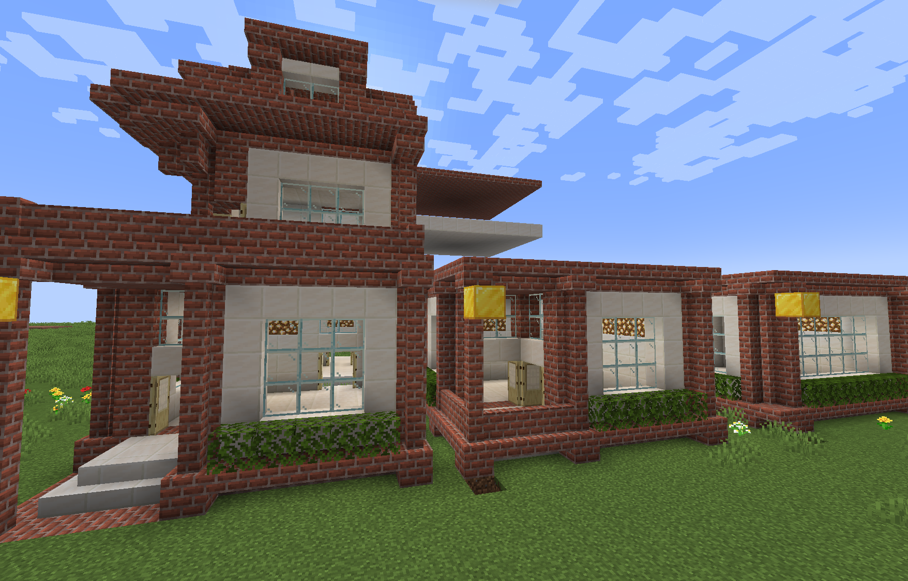
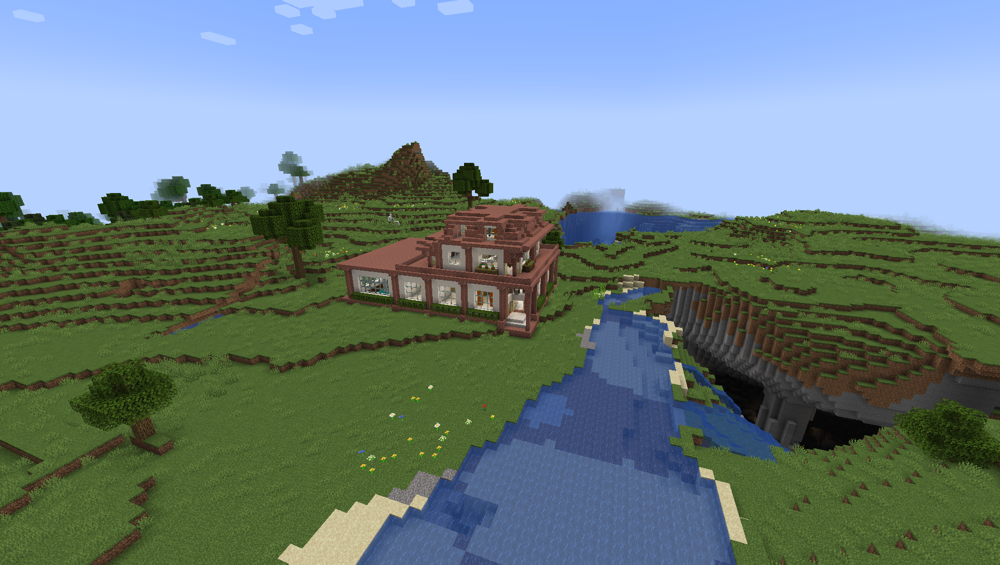

# MGAIA-Minecraft
This project was realized for the first assignment of the course Modern Game AI Algorithms at Leiden University on procedural content generation in Minecraft.

This project uses the wave function collapse algorithm to generate randomized realistic buildings in Minecraft.

# Getting Started
## Installation

The project uses Python [Poetry](https://python-poetry.org/) (version 1.3.2) to manage dependencies. However, installing the dependencies from `pyproject.toml` manually using pip should also work.
Additionally, using [Forge](https://files.minecraftforge.net/net/minecraftforge/forge/index_1.19.2.html) the [GDMC HTTP](https://github.com/Niels-NTG/gdmc_http_interface) interface mod (v1.0.0) needs to be installed in Minecraft (1.19.2).

## Running

The whole end to end script `e2e_brickhouse.py` contains building placement, building generation and interior decoration.
Below are short descriptions on how to use the most important scripts 
that `e2e_brickhouse.py` is composed of.

### Building Placement
See `buildregion_finder.py`

### Structure Scanning and Building

1. Set the build area in Minecraft using `/setbuildarea ~1 ~ ~ ~11 ~6 ~10` (or similar)
2. Update the name for the structure in `structure_scanner.py`
3. Run `structure_scanner.py`

The structures are saved in `./structures`. There are some premade ones in this repository.

You can now replicate a single structure using `structure_builder.py` or go to the next steps.

### Showcase generation

The `structure_showcase.py` builds a showcase of all available building structures. This is very useful to define the rules in the rule set 
because you get a visual representation of the structure's rotations.
Before running, you should verify that the build location in the script is okay for you.

### Building Generation

The main building generation happens in `brickhouse.py`. 
You can also run this file directly to generate a building (a brickhouse in this case).

1. Update the coordinates where to place the house in `brickhouse.py`
2. Update the maximum size of the house including air padding in `brickhouse.py`
    - `random_building(size=(7,2,7))` for a house of
    5x2x5 structure building blocks because of  
    "structure" air padding around it
3. Optionally, specify some fixed structures in `reinit()` that guide the algorithm
    - For example `wfc.collapse_cell_to_state([8,0,8], StructureRotation(brickhouse_courtyard, 0))` will ensure that a courtyard is placed at position (8,0,8) with rotation 0
    - The algorithm will use this information and build a house around it
    - This is very useful as the algorithm tends to not use certain cool structures ☹️
4. Run `brickhouse.py`. This might take a while. You can see the progress in the terminal.

You can also try to generate on a larger area like ``WaveFunctionCollapse((17,2,17), ...)`
which will likely generate multiple unconnected houses (which still follows the rules!). 
Way larger areas unfortunately don't work because of recursion depth limitations. 

